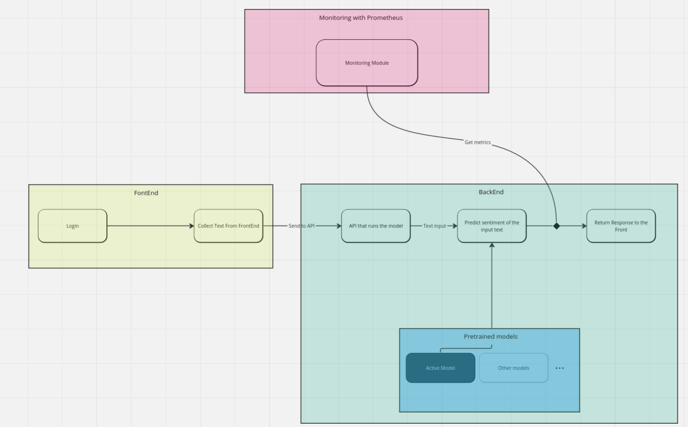
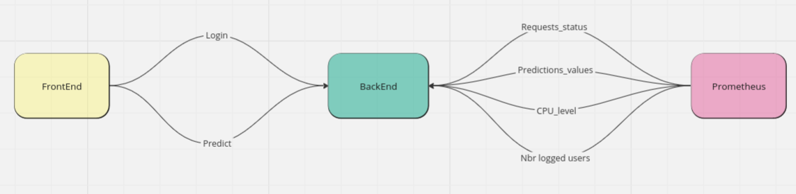
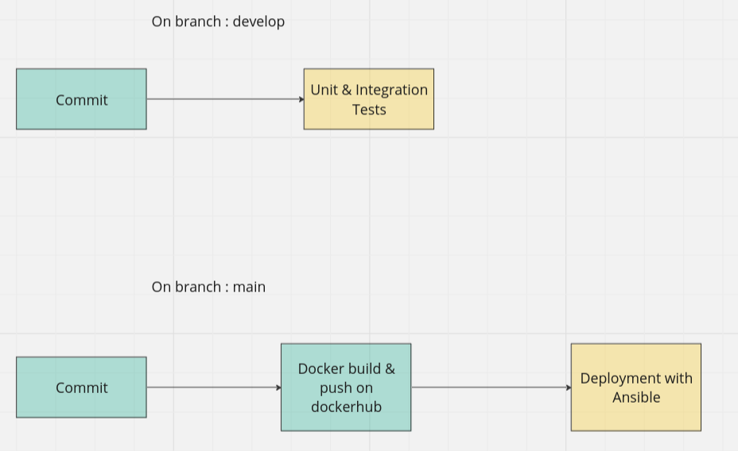

# Streamlit Sentiment Analysis Application
 
This is a simple web application built with Streamlit for sentiment analysis. It allows users to log in, submit text for sentiment analysis, and view the sentiment analysis results.
 
## Features
 
- User authentication: Users can log in with their email and password.
- Sentiment analysis: Users can submit text for sentiment analysis, and the application provides the sentiment analysis result.
 
## Components
 
- **Frontend (Streamlit)**:
  - The frontend is built with Streamlit, a Python library for building interactive web applications.
  - It consists of two main components:
    - **Login**: Users can log in with their email and password.
    - **Sentiment Analysis**: Users can submit text for sentiment analysis, and the application displays the sentiment analysis result.
 
- **Backend (Flask)**:
  - The backend service handles user authentication and sentiment analysis requests.
  - It provides RESTful API endpoints for:
    - User login/authentication (`/login`)
    - Sentiment analysis (`/predict`)
    - Metrics to monitore the whole system (`/metrics`). This route is made for prometheus

- **System monitoring (Prometheus)**:
  - Is connected to the backend and calls (`/metrics`) each 30s to get the monitoring data

## Overview of the interaction between the components

## Overview of the CI/CD pipeline

For the moment, the pipeline is automated to push docker images and run tests. Another step could be to fully automate it using ansible

## Setup Instructions
 
1. **Install Docker**:
 
2. **Run docker-compose**:
   - Run (`docker-compose up`) to create the 3 containers needed for each task
   - In case you don't have the model installed, go to the files `/backEnd/mlModel/versions/models/decisionTree/models.json` & `/backEnd/mlModel/versions/models/vectorizers/models.json` and set the property `isAlreadyTested` to `false`. That way while building backend image the models will be downloaded and tested on the test dataset loacted in `backEnd/mlModel/data/twitter_performance_1.csv`.
 
3. **Access the Application**:
   - Access the application in your web browser at `http://localhost:8501` for the frontend and `http://localhost:9090` for the monitoring with prometheus.
   - Log in with your email and password to access the sentiment analysis feature.
        - Attention !!! Only `root` is accepted as password 
 

